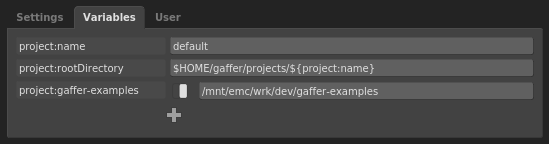
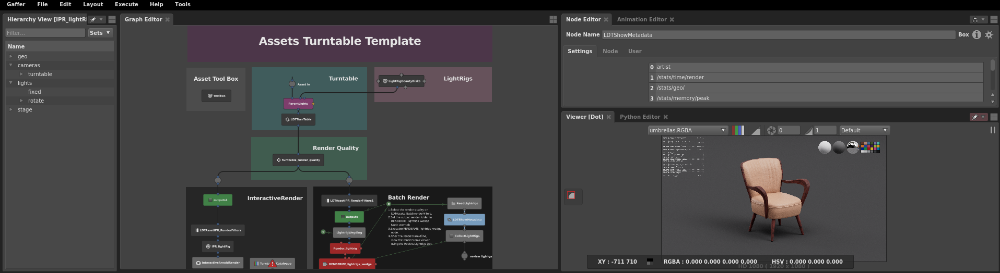
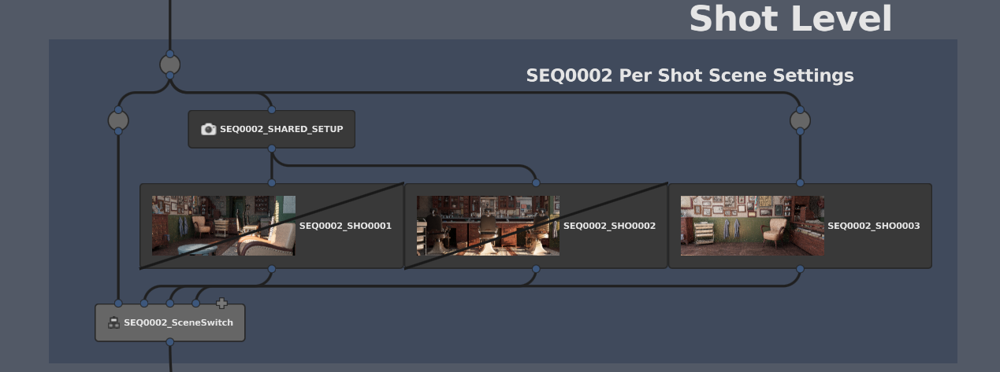
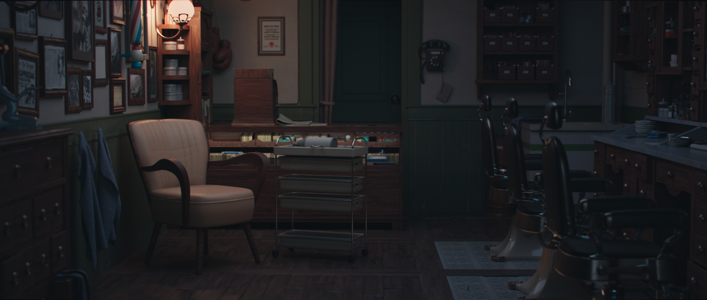
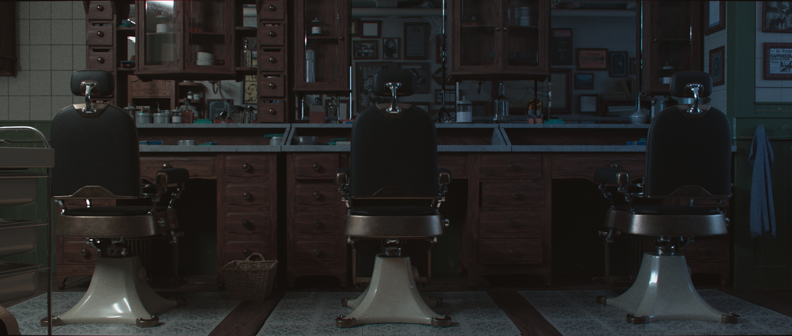
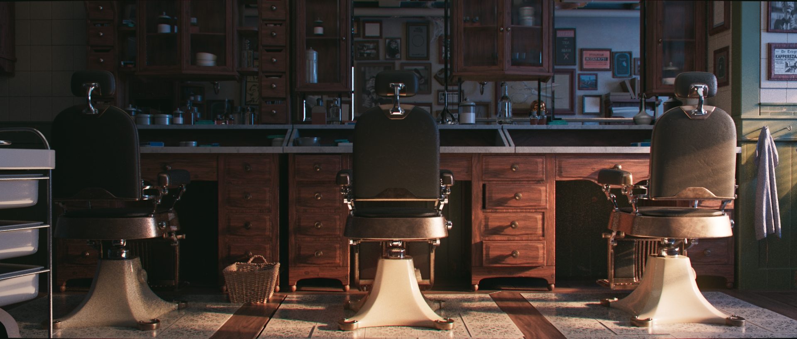
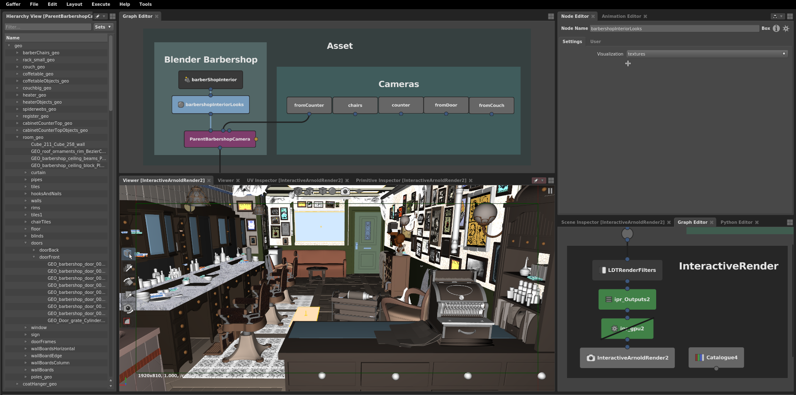
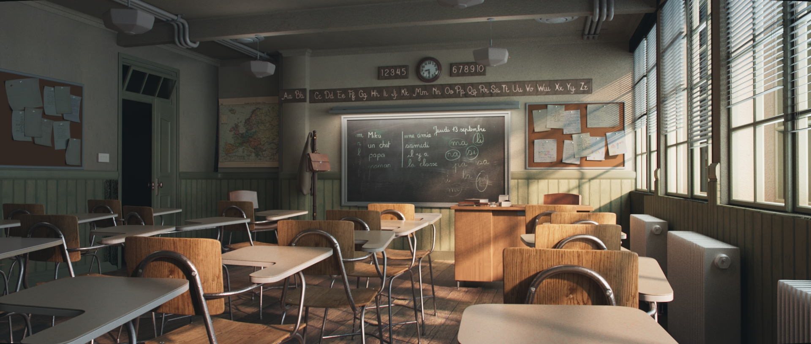
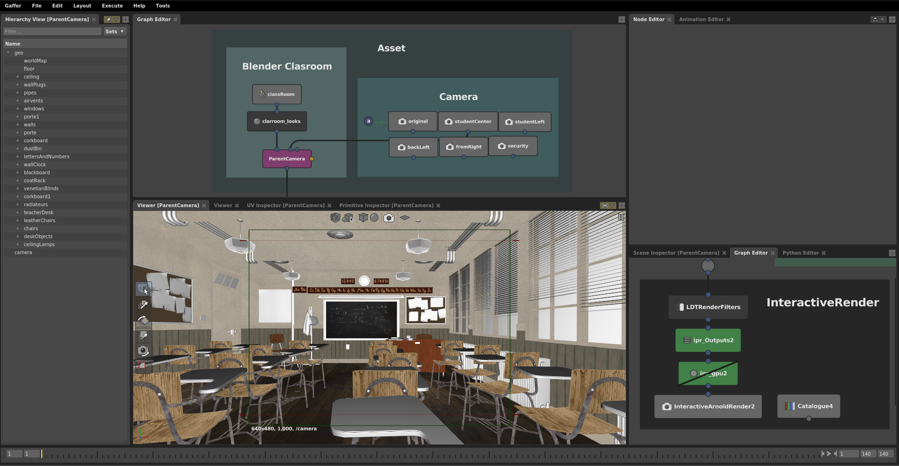

# Gaffer Examples.   

    Last Updated: 19/04/2020

***Note: Surfacing is in WIP***


[Setup](#Setup)  
[Templates](#Templates)  
[&nbsp;&nbsp;&nbsp;&nbsp;&nbsp;Assets Template](#Assets-Template)  
[&nbsp;&nbsp;&nbsp;&nbsp;&nbsp;Shots Template](#Shots-Template)  
[Renders & Screenshots](#Renders-and-Screenshots)  
[&nbsp;&nbsp;&nbsp;&nbsp;&nbsp;Barbershop](#Barbershop)  
[&nbsp;&nbsp;&nbsp;&nbsp;&nbsp;Clasroom](#Clasroom)  
[Contribute! Help wanted](#Contribute)  
[licences](#licences)  


## Setup 
##### Required
Set the project:gaffer-examples Variable to the root folder of this examples.
  

    NOTE: Due to file size limitations, the barbershop alembic file is compressed.
    Find it here /barbershop/abc/ and Uncompress it!.

##### Not really required, but nice though!
For custom image/icons like the Shot boxes to show, you will need to set up this environment var.
```
# Gaffer-examples
# Replace with your own folder!!
export GAFFERUI_IMAGE_PATHS=$GAFFERUI_IMAGE_PATHS:/mnt/emc/wrk/dev/gaffer-examples/resources/icons
```


## Templates
###### A list of nodes and functions the templates use as examples.

#### Clasroom and Barbershop Assets
* OpenGL visualizations
    * Colors & textures.
    * Sets for surfacing projects & surfacing objects using Alembic usrAttributes.
* Reusable tileable materials
    * Shaders deferred assignments using /Materials/
    * CopyAttributes node as a shader assignment tool.
    * ShaderTweak node used to tile the shared materials on specifc objects.

#### Assets Template
* NameSwitch nodes and ContextVariable nodes (for lightRigs, and render quality).
* Wedge nodes (for lightRigs rendering).
* CollectImages nodes (to load all lightRigs renders)
* ContextVariable node for IPR branch lightrig select.
* Transform nodes and FreezeTransform nodes.
* Custom Built:
    * LDTShowMetadata: Metadata keys search and overlay.
    * LDTAssetIPR_RenderFilters: Commonly used render options switchs and overrides.
    * LDTTurnTable: Camera auto framing, rotation, reference balls, etc.
    * LDTCenterToOrigin: Isolate and place objects on the world grid.



    Asset Template, with lightrigs wedging, and metadata overlay.

#### Shots Template
* NameSwitch nodes and ContextVariable nodes (for Master Lighting/Sequence/Shot).
* EditScope nodes for per shot prunes, and transforms.
* Per shot lights & blockers using Box nodes.
* Shared master lightRigs using Box nodes.
* Wedge nodes to render all the shots at once.
* Enable/Disable specific Shots.   



    Shot level Box nodes containing overrides, with rendered icons

## Renders and Screenshots

### Barbershop
   
   
   
   


### Clasroom
 


## licences
Different parts of this repository, are given with different licences.   
You can find the plaintext legalcode licence files under each folder where applicable.  

##### Clasroom 
Blender Classroom By Christophe Seux.  
Terms of Use: This work is licenced under [CC0](https://www.blender.org/download/demo-files/)

##### Barbershop
Blender Barbershop from "Agent 327" by Blender Institute   
Terms of Use: This work is licenced under [CC-BY-ND](https://cloud.blender.org/p/agent-327/about).   

Change list:
- Gaffer Scene converted from Original Blender file.   
- Export/Conversion was not possible at a 100% match.   
Certain elements -such as:objects/uvs/textures- did not translate properly   
Conversion is still pretty much in WIP and will continue to improve,  
following the original work.


##### PBR Textures
PBR textures by [www.cc0textures.com](https://www.cc0textures.com)   
Terms of Use: This work is licenced under [CC0](https://help.cc0textures.com/doku.php?id=website:licence)

##### HDRIs
###### hdrihaven
HDR under /resources/hdri/hdrihaven by [www.hdrihaven.com](https://hdrihaven.com/)   
Terms of Use: This work is licenced under [CC0](https://hdrihaven.com/p/licence.php)

###### zbyg
HDR under /resources/hdri/zbyg by [zbyg](https://hdrihaven.com/)   
Terms of Use: This work is licenced under [CC BY](https://creativecommons.org/licences/by/3.0/)

###### Icons
String lights icon by supalerk laipawat from the Noun Project   
Set Lights by Lluisa Iborra from the Noun Project  
Camera aperture tool by Vectors Point from the Noun Project  
Videocamera by Vichanon Chaimsuk from the Noun Project  
Rotation by Andrejs Kirma from the Noun Project  
Setting by ghufronagustian from the Noun Project  
Gear by Gan Khoon Lay from the Noun Project  
Fork by useiconic dot com from the Noun Project  
Layers by Creative Stall from the Noun Project  
Layers by Bernar  Novalyi from the Noun Project  
Tag by Marta Ambrosetti from the Noun Project  
Settings by Fahmi Ramdani from the Noun Project  
Tools by Vectors Point from the Noun Project


##### About CC0, CC-BY, CC-BY-ND
[CC0 Universal Public Domain Dedication](https://creativecommons.org/publicdomain/zero/1.0/)   
[CC BY](https://creativecommons.org/licences/by/3.0/)  
[CC BY-ND](https://creativecommons.org/licences/by-nd/2.0/)

## Contribute
### Help needed!
Do you feel like:
* sharing examples?
* sharing cool tricks, templates, or workflows?
* improve something from the templates?
* helping with improving assets surfacing or lighting Setups?
* helping translating the Assets and lighting to [Gaffer Cycles](https://github.com/boberfly/GafferCycles)?

#### How to Contribute
Before you start, contact us and let us know what you want to work on.  
Certain things -such as asset surfacing, and lighting updates- will need to be handled case by case, to ensure a smooth conflict-free update in the main files.  

[Fork, pull, branch, work, push, pull request as usual.](https://help.github.com/en/enterprise/2.16/user/github/collaborating-with-issues-and-pull-requests/creating-a-pull-request-from-a-fork)  

        Not everybody is familiar with CC0 licences, and its derivates.
        If you have concerns or questions about this subject, contact us.

#### Style guide
[Examples style guide](https://github.com/GafferHQ/gaffer/wiki/Examples-Style-Guide)

##### Extra styling
###### Styling Exceptions
Where nodes are Shots or Sequence based, for better readability  we prefix these nodes with `SEQ0001`  for exampe `SEQ0001_RenderQuality`, or `SEQ0001_SHO0002`
###### Icons
Icons are placed in /resources/icons.
To set a Node's icon, open the Node's EditUI window and set the Node icon as `/resources/icons/iconName.png`
###### IconScale
You can set the Node's iconScale using the code snippet below.   
The values used in the templates are `3.0`, `5.0` or `7.0`, depending on the node type and importance.
```
import Gaffer
node = root['LDTTurnTable']
Gaffer.Metadata.registerValue (node, 'iconScale', 7.0)
```

#### Licences:
* When contributing you are agreeing to submit your work under a CC0 licence.  
Attributions -although not required by this licence- will be given in this repository.
* Files from external other sources need to be compatible with CC0 licence or its derivates. See the [licences](#licences) section.  
This includes -but is not limited to- textures, `.hdr` files, `.grf` files, python scripts, Gaffer Nodes, etc.
* Licences should be listed and specified for any external sources following their requirements.
* Attributions should be given, even in the case of CC0 licenced material that do not required them.
