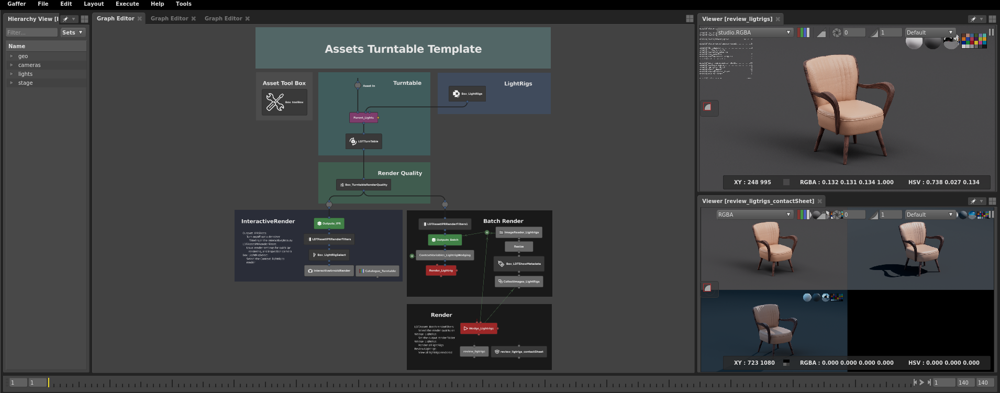
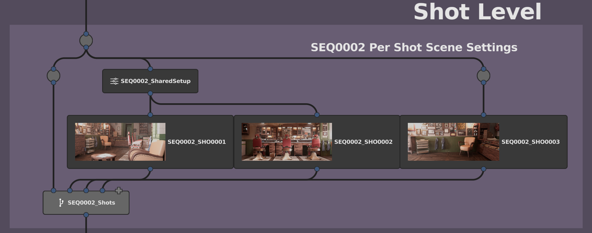

# Gaffer Examples.   

    Last Updated: 19/04/2020

***Note: Surfacing is in WIP***


[Setup](#Setup)  
[Templates](#Templates)  
[&nbsp;&nbsp;&nbsp;&nbsp;&nbsp;Assets Template](#Assets-Template)  
[&nbsp;&nbsp;&nbsp;&nbsp;&nbsp;Shots Template](#Shots-Template)  
[Renders & Screenshots](#Renders-and-Screenshots)  
[&nbsp;&nbsp;&nbsp;&nbsp;&nbsp;Barbershop](#Barbershop)  
[&nbsp;&nbsp;&nbsp;&nbsp;&nbsp;Clasroom](#Clasroom)  
[Licenses](#Licenses)  


## Setup 
##### Required
Set the project:gaffer-examples Variable to the root folder of this examples.
  

    NOTE: Due to file size limitations, the barbershop alembic file is compressed.
    Find it here /barbershop/abc/ and Uncompress it!.

##### Not really required, but nice though!
For custom image/icons like the Shot boxes to show, you will need to set up this environment var.
```
# Gaffer-examples
# Replace with your own folder!!
export GAFFER_EXAMPLES="/mnt/emc/wrk/dev/gaffer-examples" 
export GAFFERUI_IMAGE_PATHS=$GAFFERUI_IMAGE_PATHS:$GAFFER_EXAMPLES/resources/icons
```


## Templates
###### A list of nodes and functions the templates use as examples.

#### Clasroom and Barbershop Assets
* OpenGL visualizations
    * Colors & textures.
    * Surfacing Sets Projects & Objects.
* Reusable Tileable Materials
    * Shaders deferred assignments using /Materials/
    * CopyAttributes as a shader assignment tool.
    * ShaderTweaks to tile the shared materials, on specifc objects.

#### Assets Template
* NameSwitch Node and contexts (for lightRigs, and render quality).
* Wedge (for lightRigs rendering).
* CollectImages (to load all lightRigs renders)
* ContextVariable Node for IPR branch lightrig select.
* Transform and FreezeTransform.
* Custom Built:
    * LDTShowMetadata, metadata keys search, and overlay.
    * LDTAssetIPR_RenderFilters (Usual render options switchs and overrides)
    * LDTTurnTable (Camera auto framing, rotation, reference balls, etc)
    * LDTCenterToOrigin (isolates and places objects on the world grid)



    Asset Template, with lightrigs wedging, and metadata overlay.

#### Shots Template
* NameSwitch Node and contexts (for Master Lighting/Sequence/Shot).
* EditScopes for Per Shot Prunes, and Transforms.
* Per Shot Lights & Blockers.
* Shared Master lightRigs.
* Wedge Node to render Shots.
* Render all shots at once, Enable/Disable specific Shots   



    Shot Level boxes for overrides, with render icons

## Renders and Screenshots

### Barbershop
   
   
   
   


### Clasroom
 


## Licenses
Different parts of this repo, have different Licenses.   
Find the plaintext legalcode LICENSE files under each folder where applicable.

##### Clasroom 
Blender Classroom By Christophe Seux.  
Terms of Use: This work is licensed under [CC0](https://www.blender.org/download/demo-files/)

##### Barbershop
Blender Barbershop from "Agent 327" by Blender Institute   
Terms of Use: This work is licensed under [CC-BY-ND](https://cloud.blender.org/p/agent-327/about)   
Changes:
- Gaffer Scene converted from Original Blender file.   
- Export/Conversion was not possible at a 100% match.   
Certain elements -for ie:objects/uvs/textures- did not translate  
Conversion is still pretty much in WIP and will continue to improve,  
following the original work.


##### PBR Textures
PBR textures by [www.cc0textures.com](https://www.cc0textures.com)   
Terms of Use: This work is licensed under [CC0](https://help.cc0textures.com/doku.php?id=website:license)

##### HDRIs
###### hdrihaven
HDR under /resources/hdri/hdrihaven by [www.hdrihaven.com](https://hdrihaven.com/)   
Terms of Use: This work is licensed under [CC0](https://hdrihaven.com/p/license.php)

###### zbyg
HDR under /resources/hdri/zbyg by [zbyg](https://hdrihaven.com/)   
Terms of Use: This work is licensed under [CC BY](https://creativecommons.org/licenses/by/3.0/)

##### About CC0, CC-BY, CC-BY-ND
[CC0 Universal Public Domain Dedication](https://creativecommons.org/publicdomain/zero/1.0/)   
[CC BY](https://creativecommons.org/licenses/by/3.0/)  
[CC BY-ND](https://creativecommons.org/licenses/by-nd/2.0/)